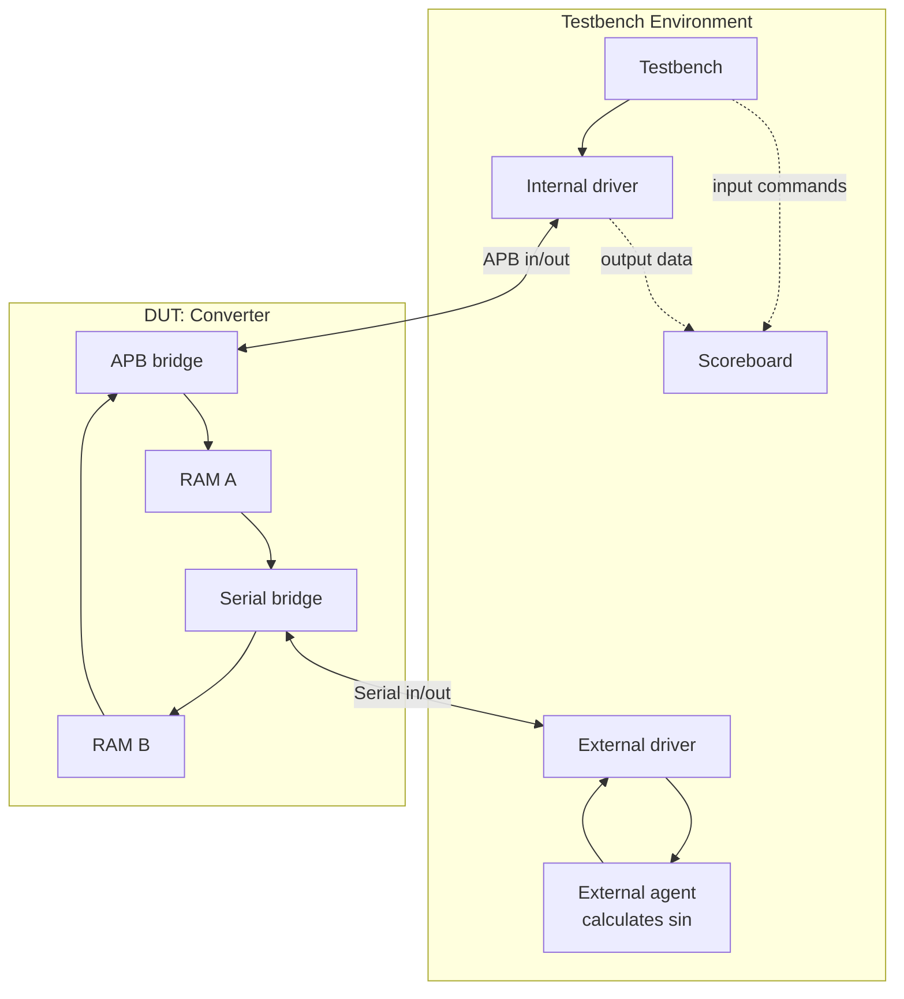

# Converter from APB to Serial


SystemVerilog implementation of a converter which transforms APb transaction with 32-bit word to serial transaction with 4 batches of 8 bits and vice versa.
Includes complete simulation environment for **QuestaSim** with modular do-file structure and project files for **Quartus** synthesis.

---

### Quick Start

1. Clone the repository
2. Open project in QuestaSim
3. Run full system simulation with command: `do run.do`

### For individual module tests
1. RAM test: `do run_ram.do`
2. APB interface test: `do run_apb.do`
3. Serial interface test: `do run_serial.do`
4. External agent test: `do run_agent.do`

## Project Structure
```text
.
├── rtl/ # SystemVerilog source files
│   ├── apb_bridge.sv 
│   ├── constants.sv
│   ├── converter.sv # Top-level module
│   ├── ram.sv
│   └── serial_bridge.sv
│
├── tb/ # Testbenches
│   ├── agent.sv
│   ├── apb_if.sv
│   ├── drv_ext.sv
│   ├── drv_int.sv
│   ├── scoreboard.sv
│   ├── serial_if.sv
│   ├── tb_constants.sv
│   ├── tb_top.sv # Top-level testbench
│   └── tests.sv
│
├── standalone/ # Testbenches for individual tests
│   ├── apb_conv_part.sv
│   ├── serial_conv_part.sv
│   ├── tb_agent.sv
│   ├── tb_apb.sv
│   ├── tb_ram.sv
│   └── tb_serial.sv
│
├── Lab1.qpf # Quartus synthesis file
├── Lab1.qsf
├── run.do # Full system simulation
├── run_agent.do
├── run_apb.do
├── run_ram.do
└── run_serial.do
```

## Requirements
The requirements are based on the environments used during development. Functionality for execution, simulation, or synthesis in other environments is not guaranteed.
* QuestaSim	2024.1 - Simulation & waveform
* Quartus (Quartus Prime 22.1std) Lite Edition - Synthesis


## Data flow diagram


## License
MIT — free for academic and commercial use.
